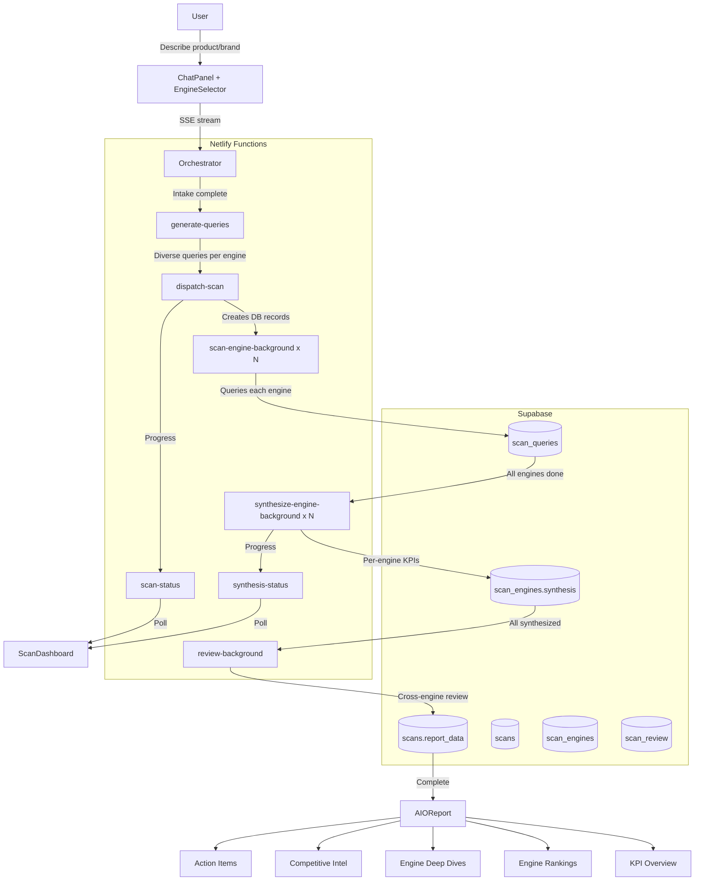

# AIO Optimization

AI search optimization audit — analyze how your product or brand is recommended across consumer AI engines.


## Features

- Chat-based intake collects product/brand info and context
- Engine selector: ChatGPT (Free/Pro), Gemini (Free/Pro), Claude (Free/Pro), Grok (Free/Pro), Perplexity, Copilot, Meta AI, Google SGE
- Configurable query count per engine (default 50)
- 7 query intent types: direct, comparative, ranked, discovery, sentiment, contextual, negative
- Real-time scan dashboard showing per-engine progress
- KPI framework: AI Share of Voice, first-position rate, recommendation strength, net sentiment, discovery capture rate, competitive win rate
- Per-engine synthesis with intent breakdowns and verbatim excerpts
- Cross-engine review with engine rankings and action items
- Interactive report with KPI overview, engine awareness table, deep dives, and competitive intel
- Public shareable report links
- Session history with soft delete

## Tech Stack

| Layer | Technology |
|-------|-----------|
| Frontend | React 19, Vite, TypeScript |
| Auth | Clerk |
| Database | Supabase (PostgreSQL + Realtime) |
| AI | Google Gemini (query generation, synthesis, review) |
| Backend | Netlify Functions |
| Design System | @boriskulakhmetov-aidigital/design-system |

## Getting Started

```bash
git clone https://github.com/boriskulakhmetov-aidigital/AIO-Optimization.git
cd AIO-Optimization
npm install

# Create .env.local with Clerk, Supabase, and Gemini keys
npm run dev
```

## Architecture



## Folder Structure

```
src/
  main.tsx              ← Entry point, ClerkProvider, theme
  App.tsx               ← AppShell + ScanBridgeProvider context
  components/
    ScanSidebar.tsx     ← Scan history
    ScanDashboard.tsx   ← Real-time scan progress
    EngineSelector.tsx  ← Engine + query count picker
    report/             ← AIOReport, KPIOverview, EngineDeepDive, etc.
  hooks/
    useOrchestrator.ts  ← SSE chat hook
    useScanPoller.ts    ← Scan progress polling
    useSynthesisPoller.ts
  lib/
    types.ts            ← Re-exports from shared types
    engineMeta.ts       ← Engine display metadata
  pages/
    PublicReportPage.tsx
netlify/
  functions/
    _shared/            ← Types, engine registry, prompts, KPI framework
    orchestrator.mts
    generate-queries.mts
    dispatch-scan.mts
    scan-engine-background.mts
    synthesize-engine-background.mts
    review-background.mts
    scan-status.mts
    synthesis-status.mts
    engine-availability.mts
```

## Key Components

| Component | Purpose |
|-----------|---------|
| `AppShell` | Auth gate, layout (from design system) |
| `ChatPanel` | Chat UI with EngineSelector input prefix |
| `EngineSelector` | Engine toggle buttons + query count slider |
| `ScanDashboard` | Real-time per-engine progress bars |
| `AIOReport` | Multi-section report (KPIs, rankings, deep dives, actions) |

## Deployment

Auto-deploys on push to `main` via Netlify GitHub integration.
